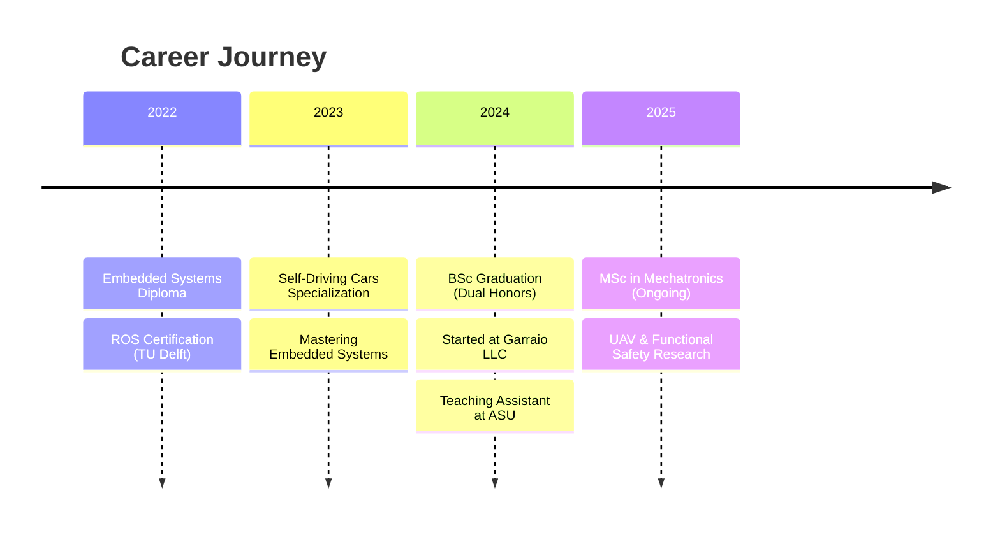

<p align="center">
  
</p>

<p align="center">
  <a href="https://www.linkedin.com/in/ahmed-hassabou-6a2287216/">
    
  </a>
  <a href="mailto:ahmed_hhassabou@outlook.com">
    
  </a>
  <a href="https://github.com/Ahmedhh1218">
    
  </a>
  
</p>

<p align="center">
  
</p>

---

## 🧑‍💻 About Me

```yaml
name: Ahmed Hassabou
location: Cairo, Egypt
current_role: Embedded Software Engineer @ Garraio LLC
education: 
  - MSc Mechatronics & Robotics (Ain Shams University) - GPA: 4.0
  - BSc Dual Degree (Ain Shams + University of East London) - First Class Honors
  
specializations:
  - Embedded Linux (Yocto, NXP i.MX8)
  - Automotive Software (CAN, AUTOSAR, Diagnostics)
  - Real-Time Systems (FreeRTOS, ARM Cortex-M)
  - Robotics (ROS/ROS2, Autonomous Systems)
  
currently_exploring:
  - UAV Software & Functional Safety
  - Cyber Security across Hardware Architectures
  - AI Integration on Edge Devices
  
fun_fact: "I turn coffee into embedded systems ☕ → 🤖"
```

---

## 🛠️ Tech Arsenal

<details open>
<summary><b>💻 Programming Languages</b></summary>
<br>
<p align="center">
  
</p>

| Language | Proficiency | Use Case |
|:--------:|:-----------:|:--------:|
| C | ████████████ Expert | Embedded Systems, RTOS, Device Drivers |
| C++ | ███████████░ Advanced | CAN Services, Linux Daemons |
| Python | ███████████░ Advanced | Automation, GUI (PyQt5), Testing |
| MATLAB | ██████████░░ Proficient | Control Systems, Simulation |
</details>

<details open>
<summary><b>🔧 Embedded & Hardware</b></summary>
<br>
<p align="center">
  <table>
    <tr>
      <td align="center" width="120">
        <br>
        <sub><b>Cortex-M3/M4/M7</b></sub>
      </td>
      <td align="center" width="120">
        <br>
        <sub><b>STM32 MCUs</b></sub>
      </td>
      <td align="center" width="120">
        <br>
        <sub><b>i.MX8 Platform</b></sub>
      </td>
      <td align="center" width="120">
        <br>
        <sub><b>ESP32/ESP-NOW</b></sub>
      </td>
      <td align="center" width="120">
        <br>
        <sub><b>TM4C/Tiva-C</b></sub>
      </td>
    </tr>
  </table>
</p>

| Platform | Skills |
|:---------|:-------|
| **Embedded Linux** | Yocto, systemd, Device Trees, EdgeX |
| **RTOS** | FreeRTOS, Task Scheduling, IPC, Memory Management |
| **Protocols** | CAN, UART, SPI, I2C, MQTT, Ethernet |
| **Debugging** | Oscilloscope, Logic Analyzer, J-Link, GDB |
</details>

<details open>
<summary><b>🚗 Automotive & Robotics</b></summary>
<br>
<p align="center">
  
  
  
  
  
</p>

- 🔌 **Automotive**: AUTOSAR, CAN/LIN, DTCs, Diagnostics (Candela, CDD)
- 🤖 **Robotics**: ROS/ROS2, SLAM, MoveIt, Autonomous Navigation
- 🏭 **Industrial**: Siemens TIA Portal, PLC S7-1200, HMI/SCADA
</details>

<details>
<summary><b>☁️ Cloud & DevOps</b></summary>
<br>
<p align="center">
  
</p>

| Tool | Application |
|:-----|:------------|
| AWS IoT Core | Device-to-Cloud Communication |
| AWS Lambda | Serverless Automation |
| Git/GitHub | Version Control, CI/CD |
| Jira/Polarion | Requirements Management |
| Jama | Requirement Traceability |
</details>

---

## 💼 Experience



### 🏢 Garraio, LLC — Embedded Software Engineer
`Nov 2024 - Present` | Cairo, Egypt

<table>
<tr>
<td width="50%">

**🐧 Embedded Linux Development**
- Built Yocto images for NXP i.MX8 platforms
- Developed C++ CAN communication daemon
- EdgeX integration for UPS systems
- Hardware interface exploration (I2C, DDC)

</td>
<td width="50%">

**🚗 Vehicle Testing & Validation**
- Testing vehicle-level requirements
- Feature-level test case execution
- Diagnostic validation (RDI, DTC)
- Gateway behavior & non-regression testing

</td>
</tr>
</table>

### 🎓 Ain Shams University — Teaching Assistant
`Jul 2024 - Present` | Faculty of Engineering

```
📚 Courses Taught:
├── Introduction to Embedded Systems
├── Real-Time and Embedded Systems Design
├── Design of Mechatronics Systems (1 & 2)
├── Intro to Computer Programming
└── Design of Autonomous Systems
```

---

## 🚀 Featured Projects

<table>
<tr>
<td width="50%">

### 🏭 SmartBatch — IoT Concrete Plant
[](/)
[](/)

> Cloud-integrated batching system with stochastic optimal control

- AWS IoT Core + Lambda + DynamoDB
- ESP32 + MQTT Communication
- Stochastic time-optimal weighing control
- **Grade: A+** (BSc Graduation Project)

</td>
<td width="50%">

### 🏥 Hospital Sterilization Robot
[](/)
[](/)

> Autonomous UV disinfection robot for healthcare

- PID Control + RTOS + ROS Integration
- Wi-Fi GUI (Python + PyQt5)
- Autonomous route planning
- Real-time obstacle detection

</td>
</tr>
<tr>
<td width="50%">

### 🪟 Power Window RTOS Control
[](/)
[](/)

> Automotive power window control system

- FreeRTOS real-time operation
- Limit switches for safety
- One-touch auto open/close
- Jam protection & window lock

</td>
<td width="50%">

### 🔄 Rotary Inverted Pendulum
[](/)
[](/)

> Furuta Pendulum control system

- LQR & MPC algorithms
- Hardware-in-the-loop simulation
- GUI for real-time monitoring
- RL algorithm experimentation

</td>
</tr>
<tr>
<td width="50%">

### 🏭 Industrial Production Line
[](/)
[](/)

> Comprehensive simulated production system

- Machining, sorting & assembly processes
- HMI real-time monitoring interface
- Fault detection & alarm system
- WinCC SCADA integration

</td>
<td width="50%">

### 🎮 Multi-Mode Embedded App
[](/)
[](/)

> Hardware application with multiple modes

- Stopwatch Mode
- Timer Mode  
- Calculator Mode
- TM4C123GH6PM ARM architecture

</td>
</tr>
</table>

---

## 🏆 Certifications

<p align="center">
  
  
  
</p>

| Certification | Issuer | Year |
|:--------------|:-------|:----:|
| 🧪 ISTQB CTFL 4.0 & CT-AUT (Automotive Tester) | ISTQB | 2024 |
| 🚗 Self-Driving Cars Specialization | University of Toronto | 2023 |
| 🔧 Mastering Embedded Systems | Learn-in-depth | 2023 |
| 🤖 ROS for Robotics | TU Delft (edX) | 2022 |
| ☁️ AWS IoT Foundation | AWS Academy | 2022 |
| 📐 MATLAB Onramps (10+ courses) | MathWorks | 2024 |

---

## 📊 GitHub Analytics

<!-- Option 1: If stats load -->


<!-- If the above don't work, you can deploy your own by forking:
     https://github.com/anuraghazra/github-readme-stats
     Then use: https://YOUR-VERCEL-APP.vercel.app/api?username=Ahmedhh1218
-->

---

## 🎯 Current Focus

```
🔬 Research Areas:
├── 🛩️ UAV Software Architecture
├── 🛡️ Functional Safety (ISO 26262)
├── 🔐 Embedded Cyber Security
└── 🧠 Edge AI & Computer Vision

📚 Learning:
├── Advanced AUTOSAR Classic & Adaptive
├── Model-Based Design (Embedded Coder)
└── Multi-Agent ROS 2 Systems
```

---

## 💬 Random Dev Quote

<p align="center">
  
</p>

---

## 🤝 Let's Connect!

<p align="center">
  <i>"Engineering is not just about building systems—it's about solving problems that matter."</i>
</p>

<p align="center">
  <a href="https://www.linkedin.com/in/ahmed-hassabou-6a2287216/">
    
  </a>
</p>

<p align="center">
  
</p>
